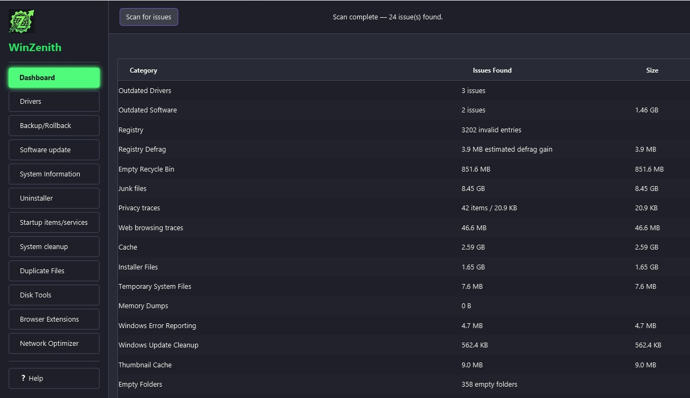
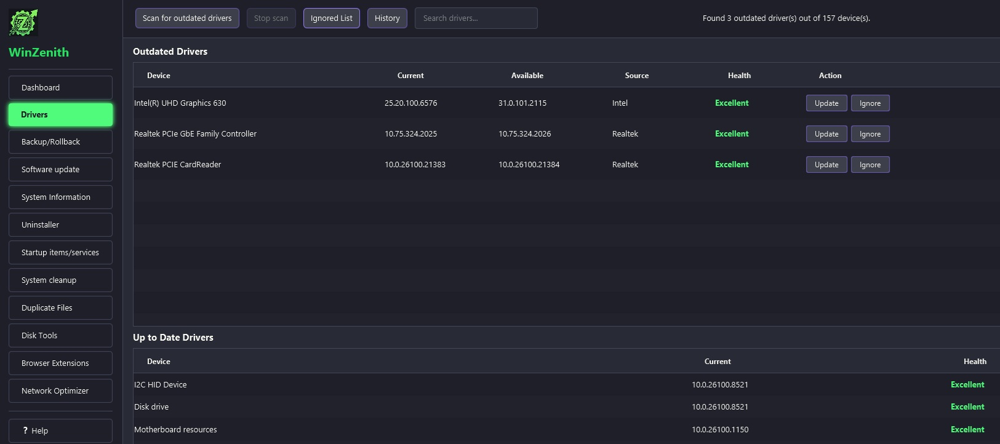
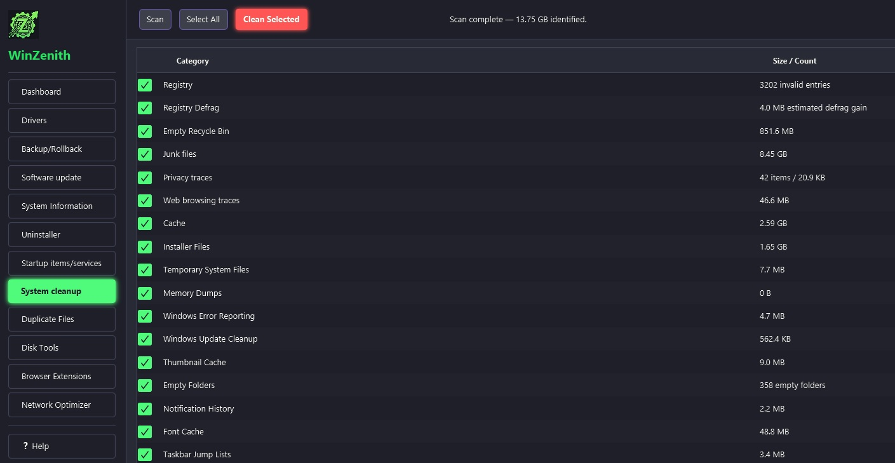

  

<h1 align="center">WinZenith</h1>

  <strong>Free Open-Source Windows System Optimizer & Cleaner</strong> 
  Clean your system, completely uninstall apps, defrag drives, and update drivers.

  
  
  
  

---

## Screenshots

  

  

  

---

## Features

| Tool | Description |
|------|-------------|
| **Dashboard** | System health overview at a glance. Scan for issues across drivers, software, and cleanup. |
| **Drivers** | Scan and update outdated drivers from 12+ major providers including Intel, NVIDIA, and Realtek. |
| **Backup / Rollback** | Create driver backups and system restore points. Easily rollback when needed. |
| **Software Update** | Keep your applications up to date via winget. Batch updates with progress tracking. |
| **System Information** | Detailed hardware and software information: OS, CPU, GPU, RAM, storage, BIOS, and more. |
| **Uninstaller** | Remove desktop and store apps with leftover file, folder, and registry cleanup. |
| **Startup Manager** | Manage startup items, scheduled tasks, and Windows services. Backup and restore configs. |
| **System Cleanup** | Clean 21 categories of temporary files, browser cache, Windows updates leftovers, and registry. |
| **Duplicate Files** | Content-hash based duplicate detection. Find and remove duplicate files to save space. |
| **Disk Tools** | Defragmentation with visual grid, secure file shredder, and free space wipe. |
| **Browser Extensions** | Manage extensions across Chrome, Edge, Firefox, Brave, Opera, and Vivaldi. |
| **Network Optimizer** | Optimize network adapters, DNS settings, and connection parameters for better performance. |

---

## Highlights

- Completely uninstall software and remove leftover registry keys and files
- Open-source Windows optimization tool 2026
- Safe, free alternative to commercial PC cleanup tools
- Portable and does not require installation

---

## Download

Download the latest release from [GitHub Releases](https://github.com/WinZenith/winzenith.github.io/releases/tag/v1.0.0).

### How to Run

1. Download `WinZenith-1.0.0-portable.zip`
2. Extract to any folder
3. Run `WinZenith.exe` as Administrator

> **Note:** Windows SmartScreen may show a warning when you first run the app. This is normal for new, unsigned applications. Click **"More info"** and then **"Run anyway"** to proceed.

---

## Requirements

- Windows 10 or Windows 11
- Java 17 or later (included in the portable package)

---

## Contact

Have a question, found a bug, or want to suggest an improvement? We'd love to hear from you.

Send us an email at: **winzenith_tools@yahoo.com**

---

## License

Free for use. See [LICENSE.txt](LICENSE.txt) for details.

---

  &copy; 2026 WinZenith. Free for use.

